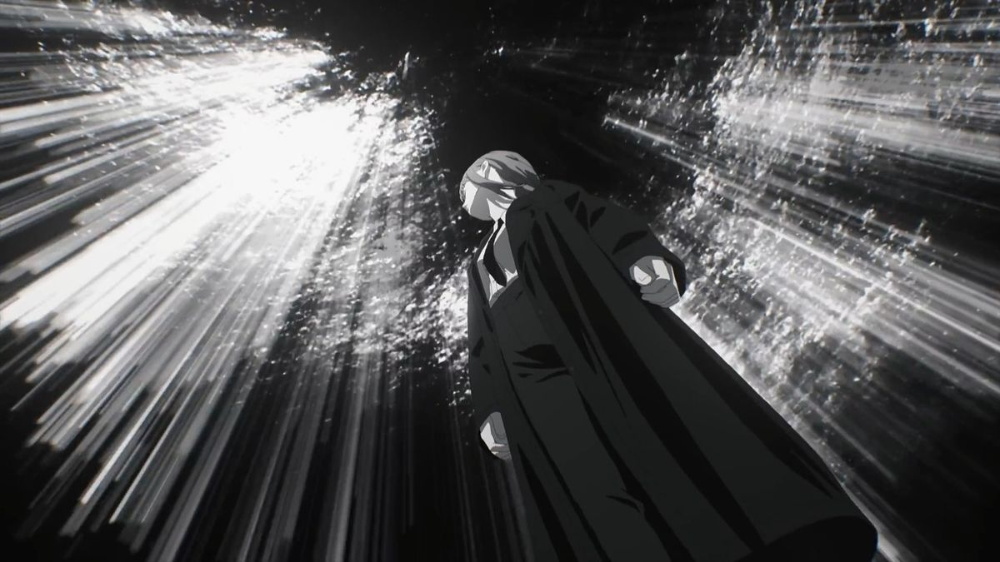

<!-- ================= БАНЕР ================= -->

  

 

<!-- ================= АНІМОВАНИЙ ЗАГОЛОВОК ================= -->

  

 

<!-- ================= ПРО МЕНЕ ================= -->
<h1 align="center" style="font-family: 'Cascadia Code SemiBold', monospace; letter-spacing: 4px; color: #00BFFF;">× ᴍᴀᴋɪᴍᴀ ×</h1>

<h2 align="center">💥 Про мене</h2>

<table align="center">
<tr>
<td>

Я — початківець у програмуванні, навчаюсь на **3 курсі Політехнічного фахового коледжу** за **121 спеціальністю**.
Люблю кодити, експериментувати з технологіями та постійно вдосконалювати свої навички.

- 🔐 Розвиваюсь у напрямку **кібербезпеки та пентесту** (PortSwigger Academy та власні лабораторні роботи)
- 💻 Практичний досвід у **C++**, **C#**, **HTML**, **CSS**, **JavaScript**
- 🗄️ Працюю з базами даних **SQL** та **MongoDB**
- 🎮 Розробляю ігри на **Unreal Engine 5** та **Roblox Studio**
- 🤝 Кодую разом з другом **Андрієм** ([@izachoc](https://github.com/izachoc)) — разом розвиваємо спільні проєкти

</td>
</tr>
</table>

 

<!-- ================= СТЕК ================= -->
<h2 align="center">⚡ Мій стек та інструменти</h2>

 

 

 

 

<!-- ================= ПРОЄКТИ ================= -->
<h2 align="center">🎇 Поточні проєкти</h2>

  
<strong>🚗 JDM_Auto</strong>

   
  <blockquote>
    Проєкт, який планую розвивати далі, щоб презентувати на курсовому. 
    Суть проєкту: сучасний сайт для українських фанатів японського автопрому, де можна знайти цікаві екземпляри та за бажанням придбати авто.
  </blockquote>

  
<strong>🍜 Davalka</strong>

   
  <blockquote>
    Командний проєкт — веб-платформа для повій та онліфанщіц без смс та реєстрації, розвивав разом з smoscalus.
  </blockquote>

  
<strong>🖥️ Компілятор (командна розробка)</strong>

   
  <blockquote>
    Курсовий командний проєкт коледжу — онлайн-компілятор/IDE для навчальних цілей.
  </blockquote>

  
<strong>📒 PolytechXXX</strong>

   
  <blockquote>
    Електронний журнал для групи, зроблений разом з Андрієм. Проєкт заморожений на ~70% готовності.
  </blockquote>

 

<!-- ================= СТАТИСТИКА ================= -->
<h2 align="center">📊 Статистика GitHub</h2>

  

 

<!-- ================= КОНТАКТИ ================= -->
<h2 align="center">👁‍🗨 Контакти</h2>

  

 

  👋 Вітаю вас! Ви дійшли до кінця мого профілю. 
  Дякую за вашу увагу та час! 
  Сподіваюсь, вам сподобалось.

